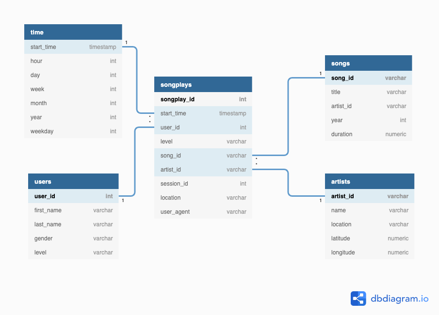

<!-----
NEW: Check the "Suppress top comment" option to remove this info from the output.

Conversion time: 0.534 seconds.

Using this Markdown file:

1. Paste this output into your source file.
2. See the notes and action items below regarding this conversion run.
3. Check the rendered output (headings, lists, code blocks, tables) for proper
   formatting and use a linkchecker before you publish this page.

Conversion notes:

* Docs to Markdown version 1.0β29
* Mon Mar 15 2021 15:27:09 GMT-0700 (PDT)
* Source doc: Udacity Project one Data Model PostgreSQL Readme
----->

**Project One: Data Modelling with Postgres**

*   Create Postgres Database and Tables: **python create_tables.py**
    *   Drops tables that already exist and creates new ones
*   Insert data into tables: **python etl.py**
    *   Extracts, processes, and inserts JSON data into Database
*   etl.py

 

**Overview**

This project builds an ETL pipeline for a music streaming service called Sparkify by fetching data from JSON files, processing the data, and inserting the data into a PostgreSQL Database. This project provides Sparkify with tools to analyze the song and user data to answer questions like “What songs are our customers listening to?”

**Technologies used**

*   Python - automate the ETL process into DB.
*   Jupyter Notebook
    *   Used to develop and test code for etl.py
    *   Etl.ipynb: Notebook used to develop and run code for etl.py
    *   Test.ipynb: Used to test SQL queries on the Postgresql database
*   SQL 
    *   Used to drop and create Sparkify Database and tables 
    *   Used to JOIN and insert data into songplays table
    *   Used to run ad-hoc queries to discover insight about the data sets
*   Postgresql Database

**Insights took from the dataset: SQL queries located in test.ipynb**

*   ./data/song_data: 71 files : contains information on songs and artist tables
*   ./data/log_data: 30 files : contains information on time and user tables
*   Songplays table requires JOIN of data from /data/log_data and /data/song_data
*   Unique Users: 97
*   Songs: 71
*   Artists: 69
*   Songplays: 6820
*   Most Popular Day to Stream: Wednesday With a count of 1364
*   Least Popular Day to Stream: Sunday With a count of 396

**Database**

The Sparkify analytics database (SparkifyDB) is a Star Schema design. The star schema separates business process data into facts, which hold the measurable, quantitative data about a business, and dimensions which are descriptive attributes related to fact data. 

**Entity Relationship Diagram (ERD)**

#### **Fact Table**

1. **songplays** - records in log data associated with page NextSong
    *   _songplay_id, start_time, user_id, level, song_id, artist_id, session_id, location, user_agent_

#### **Dimension Tables**

*   **users** - users in the app
    *   _user_id, first_name, last_name, gender, level_
*   **songs** - songs in the music database
    *   _song_id, title, artist_id, year, duration_
*   **artists** - artists in the music database
    *   _artist_id, name, location, latitude, longitude_
*   **time** - timestamps of records broken down into specific units
    *   _start_time, hour, day, week, month, year, weekday_

**_File Descriptions_**

*   test.ipynb displays the first few rows of each table to let you check your Database.
*   create_tables.py drops and creates your tables. You run this file to reset your tables before each time you run your ETL scripts.
*   etl.ipynb reads and processes a single file from song_data and log_data and loads the data into your tables. This notebook contains detailed instructions on the ETL process for each of the tables.
*   etl.py reads and processes files from song_data and log_data and loads them into your tables. 
*   sql_queries.py contains all the SQL queries used in the last three files above
